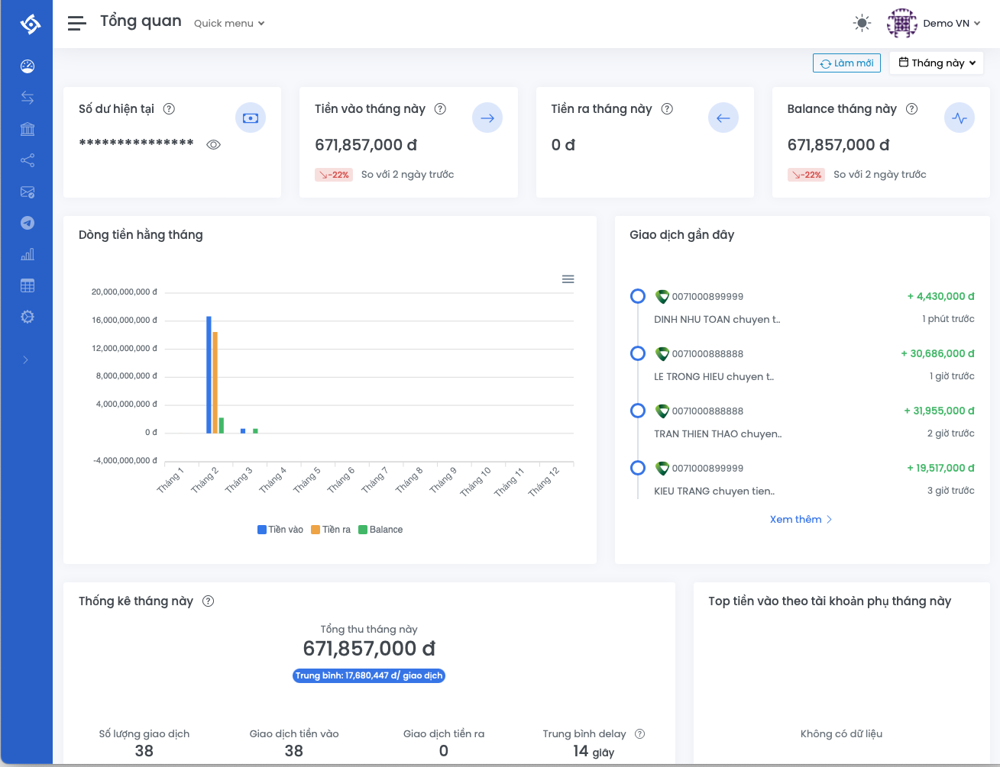

# Một số cổng thanh toán online và ví dụ

## 🔎 Các cổng thanh toán online phổ biến
1. [Cổng thanh toán SePay](#1-Cổng-thanh-toán-SePay)
2. [Cổng thanh toán PayOS](#2-Cổng-thanh-toán-PayOS)
3. [Cổng thanh toán VNPay](#3-Cổng-thanh-toán-VNPay)

## 1. Cổng thanh toán SePay
### Giới thiệu
SePay là công cụ giúp bạn chia sẻ biến động số dư ngân hàng. Tự xác thực thanh toán cho ứng dụng bán hàng khi khách chuyển khoản. SePay có thể gọi WebHooks/ API đến ứng dụng bán hàng của bạn để xác thực thanh toán. Việc này giúp tự động hóa thanh toán 100% mà không cần nhân sự kiểm tra giao dịch.

- **Tài liệu:** https://docs.sepay.vn/

- **Hướng dẫn tích hợp:** https://sepay.vn/lap-trinh-cong-thanh-toan.html

### Ưu điểm
- SePay hợp tác trực tiếp ngân hàng, không yêu cầu đăng nhập, không lưu mật khẩu internet banking.
- Tự động xác nhận thanh toán.
- Tích hợp dễ dàng.
- Có trang Dashboard theo dõi, quản lý.
### Nhược điểm

## 2. Cổng thanh toán PayOS
### Giới thiệu
### Ưu điểm
### Nhược điểm

## 3. Cổng thanh toán VNPay
### Giới thiệu
### Ưu điểm
### Nhược điểm
